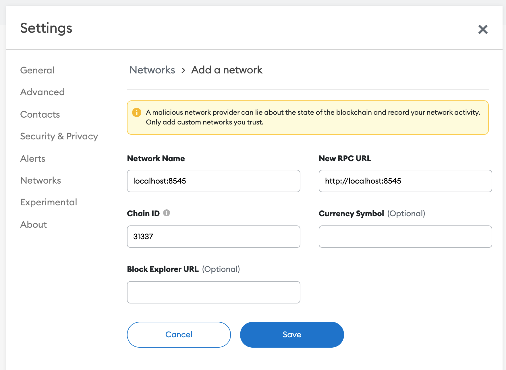

# React + NextJS + Webpacking
Example of computing proofs for the [zkdrops-contracts](https://github.com/a16z/zkdrops/zkdrops-contracts) sample repo in the browser. The majority of the work is done by the [zkdrops-lib](https://github.com/a16z/zkdrops/zkdrops-lib) which in turn uses the work of the iden3 team's Circom libraries. 

Proof computation takes 20-60s in the browser depending on the machine.

## Notes
This example front-end depends on the following locally served files:
- `mt_8192.txt` – Sample merkle tree from `zkdrops/zkdrops-contracts/test/temp/mt_8192.txt`
- `circuit_final.zkey` – ZKey used by proof generation
- `circuit.wasm` – Circom wasm used to generate circuit proof by snarkjs

The zkdrops-lib includes imports for server-side only libraries. Because this usage is browser based, this repo ignores them during webpacking in `next.config.js`.

# Testing locally
- TODO: Move this to root README.
- launch the front end: `yarn dev`
- navigate to `localhost:3000` a browser 
- point browser wallet at `localhost:8545` (see "Adding Hardhat local..." below)

### Sample keys and secrets 
| key | secret |
| --- | --- |
| 0x0049a9ef3d7fd63b5db0a70c83721ca7e53e092e3edb54de90b07e3e069258fc | 0x003dbe3ecc58da8d8f530d24733846a794fc1047d58ab81fe2dfb240bbc2e994 |
| 0x00818a031d8fae48b4685fad60bfb880451bdb0718181b224e45b27b9cd21dd6 | 0x002966f64f1829eaefa9971f07294364c9ec106b4381ab373356e6ae16897c61 |
| 0x0076f5375cb69a8b00cacb2dfbbf2f9f521ece9bc37676968e403e3aa42d283c | 0x00284cddbdb17bca11bd55822cda81e28d91f8c0fc021fb1d82d32ca93b2488b |
| 0x00372045d58eff4521feba2696634c589c522c26b8252440fdc05588b36b0b9d | 0x00d5940fd9784bbfd8e69760cd8d7f469f685e1acddc1156d8d9910a8a5fd72c |

*[source](https://github.com/a16z/zkdrops/zkdrops-contracts/blob/master/test/temp/mt_keys_8192.csv)*

### Adding Hardhat local dev chain to Metamask
- Click the "Networks" drop down and then click "Add Network"
- Fill out with the following settings:
